# Website screenshots

These 19 screenshots were captured from the production build at 1440×1000 and 390×844 mobile viewports. They use a reproducible local fixture with realistic trips, itinerary activities, community stories, saved cities, sharing, and admin analytics.

## Authentication

| Login | Registration |
| --- | --- |
| [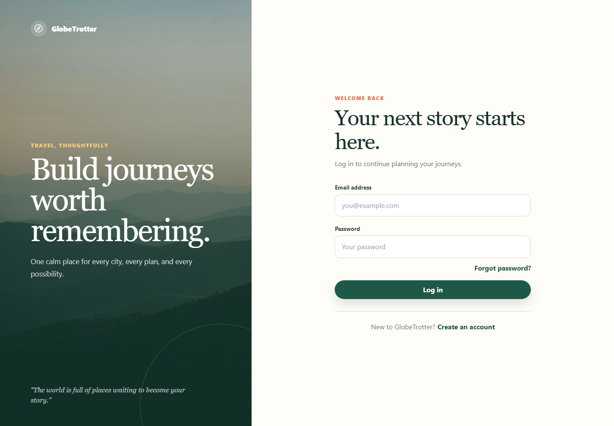](./assets/screenshots/login.png) | [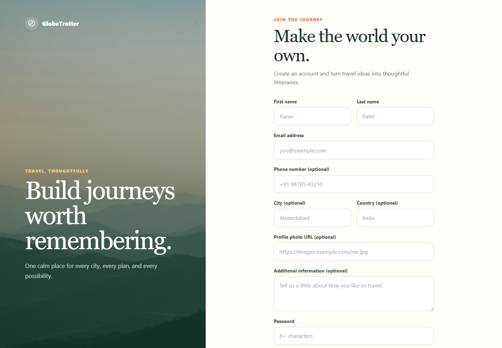](./assets/screenshots/registration.png) |

## Core planning experience

### Dashboard

[](./assets/screenshots/dashboard.png)

### Destination discovery

[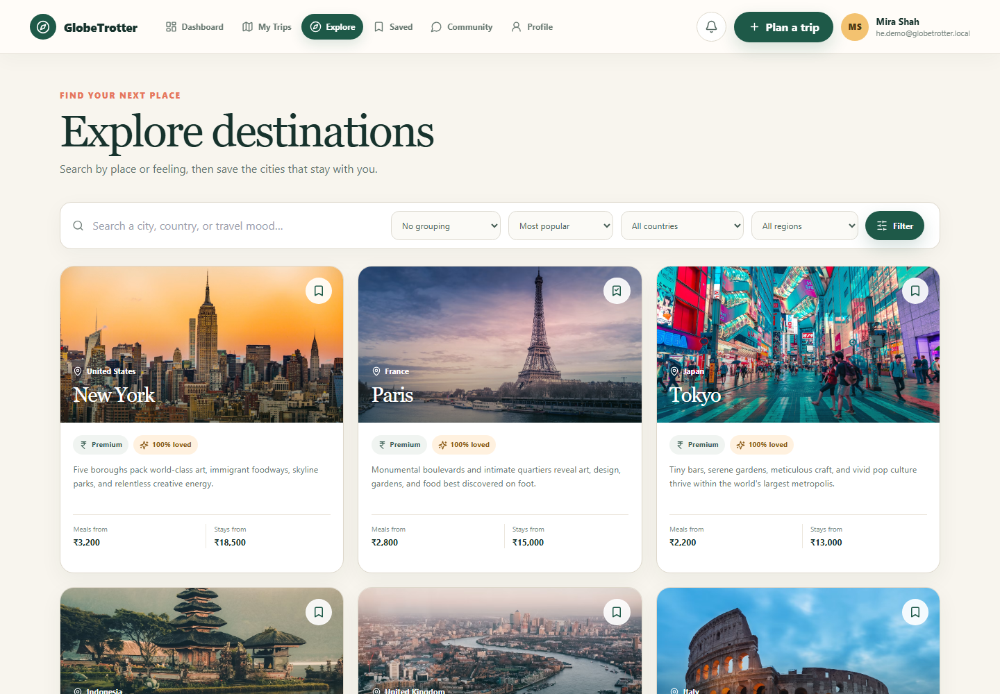](./assets/screenshots/explore.png)

### My Trips

[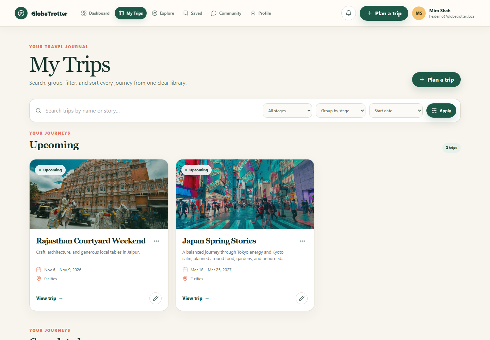](./assets/screenshots/my-trips.png)

### Plan a new trip

[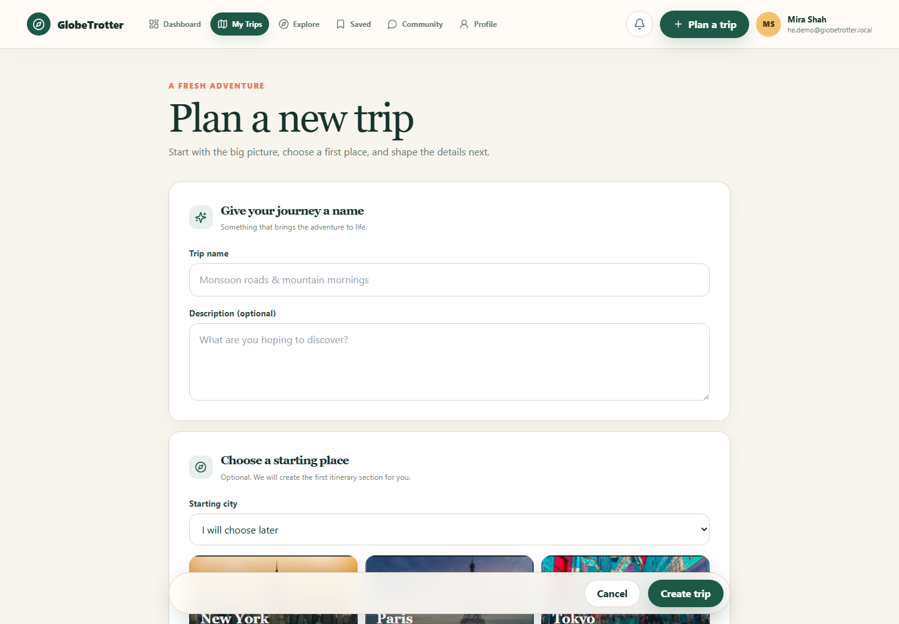](./assets/screenshots/new-trip.png)

### Trip itinerary

[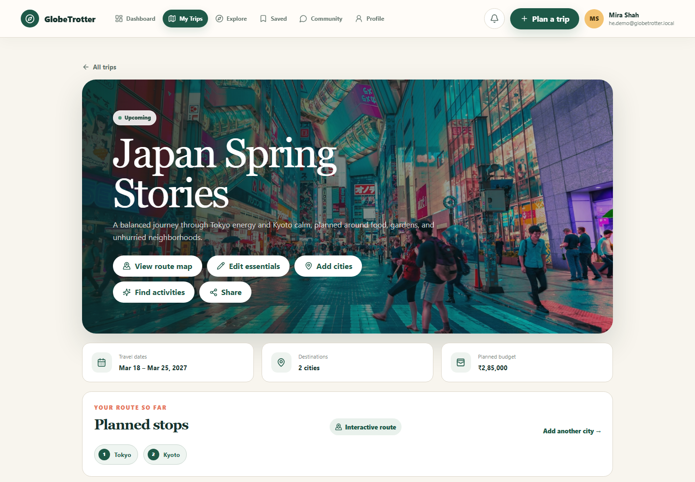](./assets/screenshots/itinerary.png)

### Interactive route map

[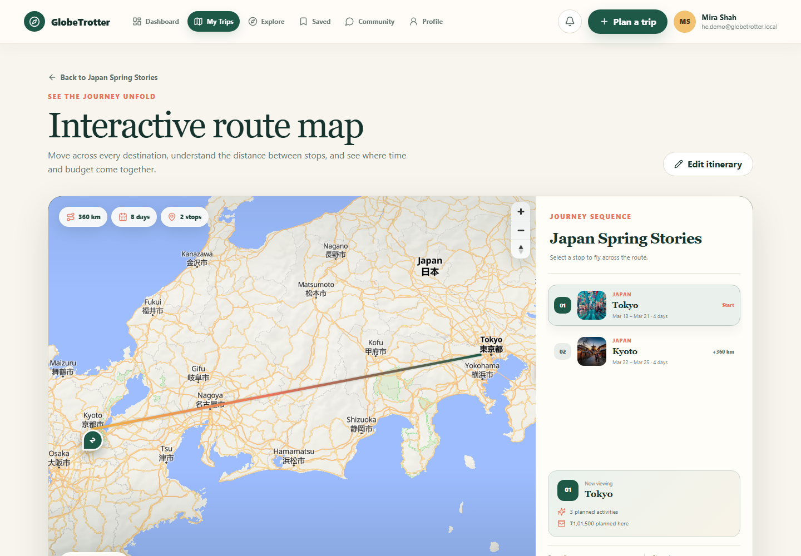](./assets/screenshots/route-map.png)

### Responsive route map

[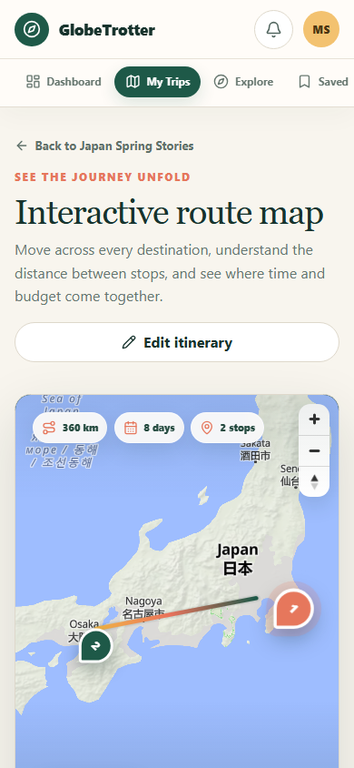](./assets/screenshots/route-map-mobile.png)

### Drag-and-drop itinerary builder

[](./assets/screenshots/builder.png)

### Budget analytics

[](./assets/screenshots/budget.png)

### Calendar

[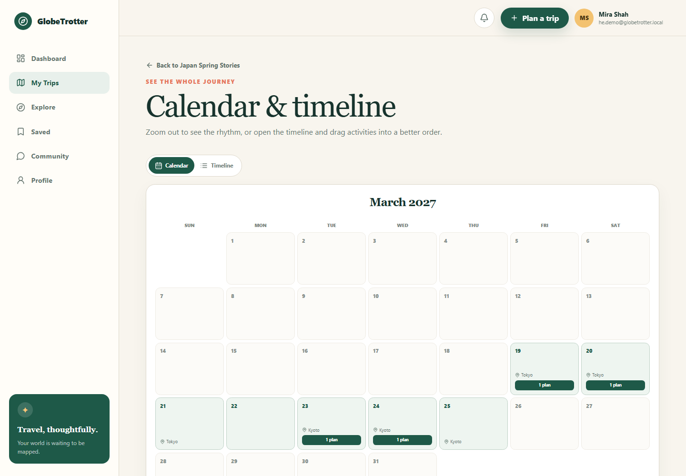](./assets/screenshots/calendar.png)

## Sharing and community

### Sharing controls

[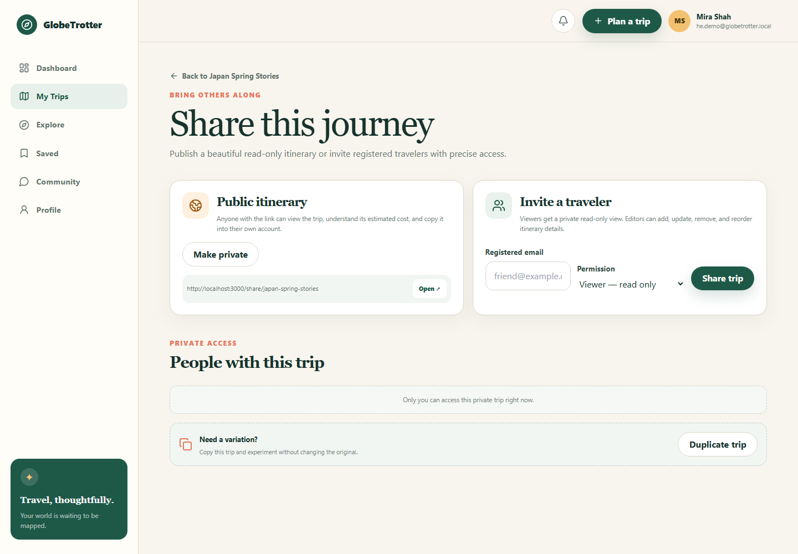](./assets/screenshots/sharing.png)

### Public itinerary

[](./assets/screenshots/public-itinerary.png)

### Traveler community

[](./assets/screenshots/community.png)

## Account and administration

### Profile and settings

[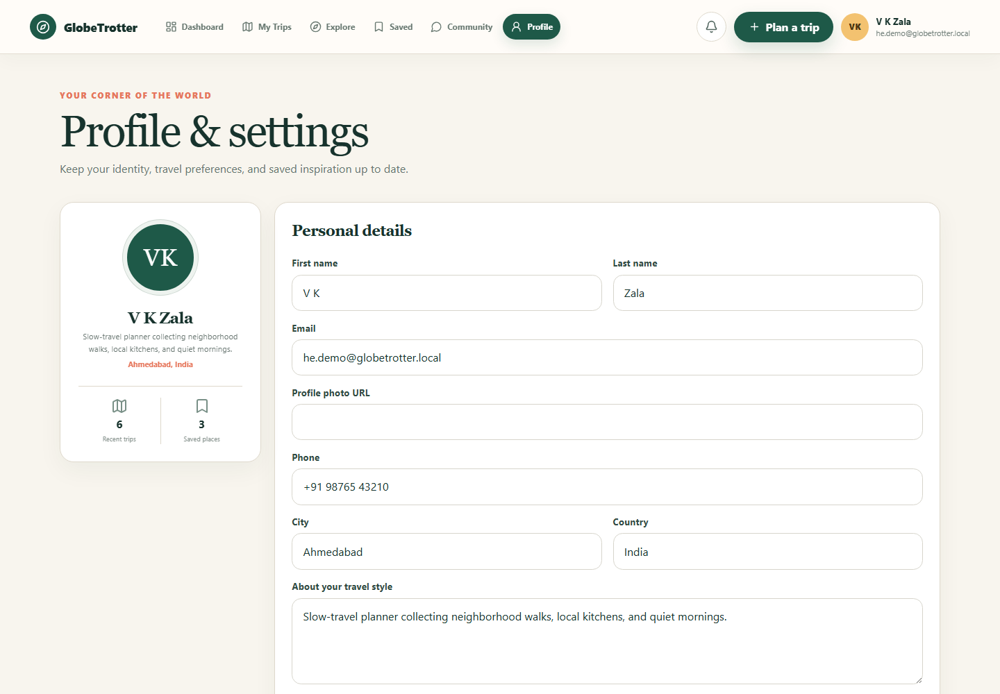](./assets/screenshots/profile.png)

### Profile trip collections

[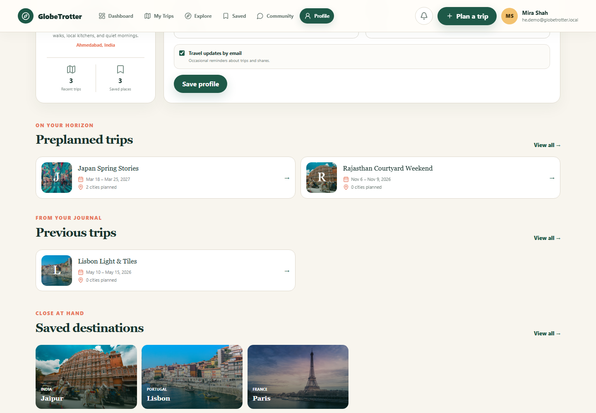](./assets/screenshots/profile-trips.png)

### Admin analytics

[](./assets/screenshots/admin.png)

### Mobile dashboard

[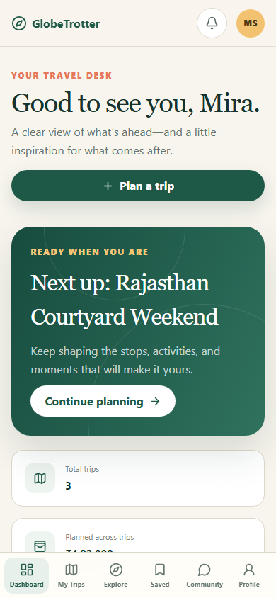](./assets/screenshots/dashboard-mobile.png)

## Regenerating the gallery

With PostgreSQL configured and Chromium installed:

```bash
npx prisma migrate deploy
npm run db:seed
npx playwright install chromium
npm run docs:screenshots
```

The generator resets only the dedicated `he.demo@globetrotter.local` fixture and does not delete other users. Never use the documentation password as a production credential.
